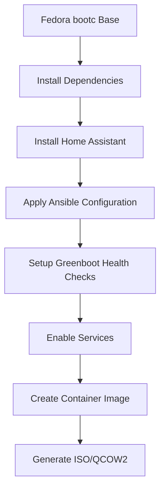

# HassOS-Bootc

**Home Assistant, Container-Native** 🏠

HassOS-Bootc is a modern, immutable Home Assistant deployment solution built on Fedora's bootc technology. It provides a container-native approach to running Home Assistant on bare metal hardware, combining the reliability of immutable systems with the flexibility of containerized applications.

## 🎯 What Makes HassOS-Bootc Different?

### Traditional Home Assistant OS vs HassOS-Bootc

| Feature | Traditional HassOS | HassOS-Bootc |
|---------|-------------------|--------------|
| **Base OS** | Custom Linux | Fedora (upstream) |
| **Update Model** | Full OS updates | Container-based updates |
| **Immutable** | ✅ | ✅ |
| **Container Runtime** | Docker | Podman |
| **Configuration** | HassOS-specific | Ansible + systemd |
| **Health Checks** | HassOS supervisor | Greenboot |
| **Deployment** | HassOS installer | bootc installer |

### Key Benefits

- 🐳 **Container-Native**: Built for the container era with Podman
- 🔒 **Immutable**: System integrity through read-only root filesystem
- ⚡ **Fast Updates**: Update only the Home Assistant container, not the entire OS
- 🛡️ **Secure**: Fedora's security model with SELinux and system hardening
- 🔄 **Auto-Recovery**: Greenboot health checks with automatic rollback
- 📦 **Standard Tools**: Uses familiar Linux tools and Ansible for configuration

## 🏗️ How HassOS-Bootc Works

### Architecture Overview

HassOS-Bootc follows a layered architecture that separates concerns and ensures reliability:

```
┌─────────────────────────────────────────────────────────────┐
│                    Hardware Layer                           │
├─────────────────────────────────────────────────────────────┤
│                 Fedora bootc Base                           │
│  ┌─────────────────┐  ┌─────────────────┐  ┌─────────────┐ │
│  │   Immutable     │  │   Container     │  │  Health     │ │
│  │   Root FS       │  │   Runtime       │  │  Monitoring │ │
│  │   (read-only)   │  │   (Podman)      │  │  (Greenboot)│ │
│  └─────────────────┘  └─────────────────┘  └─────────────┘ │
├─────────────────────────────────────────────────────────────┤
│              Home Assistant Container                       │
│  ┌─────────────────────────────────────────────────────────┐ │
│  │  Home Assistant Core + Add-ons + Configuration         │ │
│  └─────────────────────────────────────────────────────────┘ │
└─────────────────────────────────────────────────────────────┘
```

### Core Components

#### 1. **Fedora bootc Base**
- **Immutable Root**: The entire root filesystem is read-only
- **Atomic Updates**: System updates are atomic - either complete success or complete rollback
- **Bootc Integration**: Uses Fedora's bootc for container-to-OS conversion

#### 2. **Container Runtime (Podman)**
- **Rootless Containers**: Runs containers without root privileges
- **Systemd Integration**: Containers managed as systemd services
- **Auto-Update**: Containers can be updated independently of the OS

#### 3. **Configuration Management (Ansible)**
- **Idempotent**: Configuration can be applied multiple times safely
- **Declarative**: Describes desired state, not how to achieve it
- **Version Controlled**: All configuration is stored in Git

#### 4. **Health Monitoring (Greenboot)**
- **Boot Health Checks**: Verifies system health during boot
- **Automatic Rollback**: Reverts to previous version if health checks fail
- **Service Monitoring**: Ensures Home Assistant is running correctly

### Build Process Explained



#### Step-by-Step Build Process:

1. **Base Image**: Start with `quay.io/fedora/fedora-bootc:42`
2. **Dependencies**: Install Python, Podman, Ansible, and build tools
3. **Home Assistant**: Install Home Assistant via pip
4. **Configuration**: Apply Ansible playbooks to configure the system
5. **Health Checks**: Deploy Greenboot scripts for monitoring
6. **Services**: Enable Home Assistant as a systemd service
7. **Image Creation**: Build the final container image
8. **Deployment**: Generate ISO or QCOW2 for installation

### Runtime Operation

#### Boot Sequence:
1. **System Boot**: Fedora bootc initializes the immutable root
2. **Health Checks**: Greenboot runs pre-boot health checks
3. **Service Start**: systemd starts the Home Assistant container
4. **Health Verification**: Post-boot health checks ensure everything is working
5. **Ready**: Home Assistant is accessible on port 8123

#### Update Process:
1. **Container Update**: New Home Assistant container is pulled
2. **Health Check**: System verifies the new container is healthy
3. **Service Restart**: Home Assistant service restarts with new container
4. **Verification**: Health checks confirm the update was successful
5. **Rollback**: If health checks fail, system automatically reverts

## 🚀 Quick Start

### Prerequisites
- Podman 4.0+ installed
- Ansible Core 2.12+ (for validation)
- bootc-image-builder (for ISO generation)

### Build Process
```bash
# 1. Build the container image
make build

# 2. Run comprehensive tests
make test

# 3. Generate bootable ISO
make iso

# 4. Generate QCOW2 for VMs
make qcow2
```

### Quick Validation
```bash
# Smoke test the built image
make smoke-test

# Check bootc metadata
podman run --rm --privileged hassos-bootc:dev bootc status

# Verify Home Assistant service
podman run --rm hassos-bootc:dev /usr/bin/systemctl status home-assistant
```

### Available Make Targets
```bash
make help              # Show all available targets
make build             # Build the container image
make test              # Run all tests
make iso               # Generate bootable ISO
make qcow2             # Generate QCOW2 for VMs
make iso-arm64         # Generate ARM64 ISO for Raspberry Pi
make images            # Generate all image formats
make clean             # Clean build artifacts
make validate          # Run validation checks
```

## 📁 Project Structure

```
hassos-bootc/
├── Containerfile              # Multi-stage container build definition
├── Makefile                   # Build automation and targets
├── bindep.txt                 # System package dependencies
├── ansible/                   # Configuration management
│   ├── playbooks/site.yml     # Main Ansible playbook
│   └── roles/homeassistant.bootstrap/  # Home Assistant setup role
├── containers-systemd/        # Systemd service definitions
│   └── home-assistant.service # Home Assistant container service
├── greenboot/                 # Health monitoring scripts
│   └── check/                 # Boot and runtime health checks
├── tests/                     # Testing and validation scripts
├── build/                     # Build helper scripts
└── docs/                      # Documentation
```

## ⚙️ Technical Details

### Containerfile Architecture

The `Containerfile` uses a multi-stage build approach:

```dockerfile
# Stage 1: Ansible preparation
FROM quay.io/fedora/fedora-bootc:42 AS ansible-stage
RUN dnf -y install ansible-core linux-system-roles

# Stage 2: Main image build
FROM quay.io/fedora/fedora-bootc:42
RUN dnf -y install python3-pip podman ansible-core greenboot systemd-udev gcc python3-devel
RUN pip3 install --no-cache-dir homeassistant
RUN dnf -y remove gcc python3-devel  # Clean up build dependencies
```

### Ansible Configuration

The Ansible playbook (`ansible/playbooks/site.yml`) handles:

- **Directory Creation**: Sets up Home Assistant data and config directories
- **Service Configuration**: Installs and configures the systemd service
- **Environment Setup**: Configures Home Assistant environment variables
- **Permissions**: Sets proper file ownership and permissions

### Systemd Integration

Home Assistant runs as a systemd service with:

- **Container Management**: Uses Podman to run the Home Assistant container
- **Auto-restart**: Automatically restarts on failure
- **Logging**: Integrated with systemd journal
- **Dependencies**: Proper service dependencies and ordering

### Greenboot Health Checks

Two types of health checks ensure system reliability:

#### Required Checks (`greenboot/check/required.d/`)
- **10-home-assistant.sh**: Verifies Home Assistant is running and responding
- **Hard Failures**: System will rollback if these checks fail

#### Wanted Checks (`greenboot/check/wants.d/`)
- **30-podman-network.sh**: Verifies container networking is working
- **Soft Failures**: Logs issues but doesn't trigger rollback

## 🚀 Deployment & Usage

### Installation Methods

#### 1. **ISO Installation (Bare Metal)**
```bash
# Generate bootable ISO
make iso

# Create bootable USB
sudo dd if=out/hassos-bootc.iso of=/dev/sdX bs=4M status=progress

# Boot from USB and follow installer
```

#### 2. **QCOW2 Installation (Virtual Machines)**
```bash
# Generate QCOW2 image
make qcow2

# Use with QEMU/KVM, VirtualBox, or VMware
qemu-system-x86_64 -machine q35 -cpu host -m 2048 \
  -drive file=out/hassos-bootc.qcow2,format=qcow2 \
  -netdev user,id=net0,hostfwd=tcp::8123-:8123 \
  -device e1000,netdev=net0
```

#### 3. **ARM64 Installation (Raspberry Pi)**
```bash
# Generate ARM64 ISO
make iso-arm64

# Flash to SD card for Raspberry Pi 4/5
sudo dd if=out/hassos-bootc-arm64.iso of=/dev/mmcblk0 bs=4M status=progress
```

### Post-Installation

After installation, Home Assistant will be available at:
- **Web Interface**: `http://<device-ip>:8123`
- **SSH Access**: `ssh root@<device-ip>` (if enabled)
- **Service Management**: `systemctl status home-assistant`

### System Management

#### Update Home Assistant
```bash
# Update to latest container
podman pull ghcr.io/home-assistant/home-assistant:stable
systemctl restart home-assistant

# Or use bootc for system updates
bootc update --apply
```

#### Health Monitoring
```bash
# Check system health
journalctl -u greenboot-healthcheck

# View Home Assistant logs
journalctl -u home-assistant -f

# Manual health check
/etc/greenboot/check/required.d/10-home-assistant.sh
```

#### Rollback (if needed)
```bash
# List available rollback targets
bootc rollback --list

# Rollback to previous version
bootc rollback --target <previous-ref>
```

## 🎯 Why Choose HassOS-Bootc?

### Advantages Over Traditional Home Assistant OS

| Aspect | Traditional HassOS | HassOS-Bootc |
|--------|-------------------|--------------|
| **Base OS** | Custom, limited | Fedora (full Linux) |
| **Package Management** | HassOS supervisor only | Standard dnf/rpm |
| **System Access** | Limited | Full root access |
| **Customization** | Add-ons only | Full system customization |
| **Updates** | Full OS rebuild | Container updates |
| **Debugging** | Limited tools | Full Linux toolchain |
| **Backup** | HassOS snapshots | Standard Linux backup tools |
| **Networking** | HassOS network | Standard NetworkManager |

### Ideal Use Cases

#### ✅ **Perfect For:**
- **Power Users**: Who want full system control and customization
- **Developers**: Who need debugging tools and system access
- **Homelab Enthusiasts**: Who want to integrate with existing infrastructure
- **Security-Conscious Users**: Who prefer immutable, auditable systems
- **Edge Deployments**: Where reliability and automatic recovery are critical

#### ❌ **Not Ideal For:**
- **Beginners**: Who prefer the simplicity of traditional HassOS
- **Users**: Who only need basic Home Assistant functionality
- **Limited Hardware**: Systems with less than 2GB RAM or 8GB storage

### Comparison with Other Solutions

| Solution | Immutable | Container-Native | Auto-Recovery | Full Linux |
|----------|-----------|------------------|---------------|------------|
| **HassOS-Bootc** | ✅ | ✅ | ✅ | ✅ |
| **Traditional HassOS** | ✅ | ❌ | ✅ | ❌ |
| **Home Assistant Container** | ❌ | ✅ | ❌ | ✅ |
| **Home Assistant Core** | ❌ | ❌ | ❌ | ✅ |

## 🔧 Configuration Overview

### Key Components
- **Home Assistant**: Containerized using official image `ghcr.io/home-assistant/home-assistant:stable`
- **Podman**: Container runtime with auto-update labels
- **linux-system-roles**: Ansible collection for system configuration
- **Greenboot**: Health checks for Day 2 operations

## Practical Examples

### Custom Home Assistant Configuration
To customize Home Assistant settings, modify the environment file:

```bash
# Edit the environment template
vim ansible/roles/homeassistant.bootstrap/templates/home-assistant.env.j2

# Add custom environment variables
HA_IMAGE=ghcr.io/home-assistant/home-assistant:stable
CUSTOM_COMPONENTS_DIR=/var/lib/home-assistant/custom_components
```

### Adding Custom Components
1. Create a custom components directory:
```bash
mkdir -p /var/lib/home-assistant/custom_components
```

2. Mount it in the systemd service:
```bash
# Edit containers-systemd/home-assistant.service
--volume /var/lib/home-assistant/custom_components:/config/custom_components:Z \
```

### Network Configuration
The default configuration uses host networking. To use a custom network:

```bash
# Create a custom network
podman network create hass-net

# Modify the systemd service to use the network
--network hass-net \
```

## Day 2 Operations

### System Updates
```bash
# Update to latest image
bootc update --apply

# Verify update success
journalctl -u bootc-fetch
journalctl -u greenboot-healthcheck

# Check Home Assistant status
systemctl status home-assistant
```

### Rollback Procedures
```bash
# List available rollback targets
bootc rollback --list

# Rollback to previous version
bootc rollback --target <previous-ref>

# Verify rollback success
journalctl -u greenboot-healthcheck --since "5 minutes ago"
```

### Health Monitoring
```bash
# Check Greenboot health status
journalctl -u greenboot-healthcheck

# Run health checks manually
/etc/greenboot/check/required.d/10-home-assistant.sh
/etc/greenboot/check/wants.d/30-podman-network.sh

# Monitor Home Assistant logs
podman logs home-assistant --follow
```

## Troubleshooting

### Common Issues

#### Build Failures
```bash
# Check build logs
podman build -t homeassistant-bootc:dev . 2>&1 | tee build.log

# Verify dependencies
./build/generate-bindep.sh

# Test Ansible syntax
ansible-playbook -i localhost, -c local --syntax-check ansible/playbooks/site.yml
```

#### Service Issues
```bash
# Check service status
systemctl status home-assistant

# View service logs
journalctl -u home-assistant -f

# Restart service
systemctl restart home-assistant

# Check container status
podman ps -a
podman logs home-assistant
```

#### Health Check Failures
```bash
# Run health checks manually
/etc/greenboot/check/required.d/10-home-assistant.sh

# Check Greenboot logs
journalctl -u greenboot-healthcheck

# Verify network connectivity
curl -I http://localhost:8123/
```

#### Network Issues
```bash
# Check podman networks
podman network ls
podman network inspect podman

# Test connectivity
podman exec home-assistant curl -I http://localhost:8123/

# Check firewall
firewall-cmd --list-all
```

### Debug Mode
Enable debug logging by modifying the environment file:

```bash
# Add debug environment variables
echo "PYTHONUNBUFFERED=1" >> /etc/home-assistant/home-assistant.env
echo "LOG_LEVEL=debug" >> /etc/home-assistant/home-assistant.env
systemctl restart home-assistant
```

### Recovery Procedures
If the system fails to boot or Home Assistant won't start:

1. **Boot from recovery media**
2. **Check system logs**: `journalctl -b`
3. **Verify container image**: `podman images`
4. **Recreate container**: `systemctl restart home-assistant`
5. **Check configuration**: `cat /var/lib/home-assistant/configuration.yaml`

## Installation Examples

### QCOW2 VM Installation

The QCOW2 format is ideal for virtual machine deployments and testing environments.

#### Prerequisites
- Virtualization software (QEMU/KVM, VirtualBox, VMware)
- At least 2GB RAM and 8GB disk space
- Network access for Home Assistant

#### Step 1: Generate QCOW2 Image
```bash
# Build the container image
podman build -t homeassistant-bootc:dev .

# Generate QCOW2 image using bootc
bootc image build \
  --target-arch=x86_64 \
  --ref quay.io/yourrepo/homeassistant-bootc:dev \
  --output qcow2=out/homeassistant.qcow2 .
```

#### Step 2: Create Virtual Machine
```bash
# Using QEMU/KVM
qemu-system-x86_64 \
  -machine q35 \
  -cpu host \
  -m 2048 \
  -drive file=out/homeassistant.qcow2,format=qcow2 \
  -netdev user,id=net0,hostfwd=tcp::8123-:8123 \
  -device e1000,netdev=net0 \
  -boot order=dc

# Using VirtualBox
VBoxManage createvm --name "HomeAssistant-bootc" --ostype Fedora_64 --register
VBoxManage modifyvm "HomeAssistant-bootc" --memory 2048 --cpus 2
VBoxManage storagectl "HomeAssistant-bootc" --name "SATA Controller" --add sata --controller IntelAhci
VBoxManage storageattach "HomeAssistant-bootc" --storagectl "SATA Controller" --port 0 --device 0 --type hdd --medium out/homeassistant.qcow2
VBoxManage modifyvm "HomeAssistant-bootc" --nic1 nat --nictype1 82540EM
VBoxManage startvm "HomeAssistant-bootc"
```

#### Step 3: Access Home Assistant
```bash
# Wait for VM to boot (2-3 minutes)
# Access Home Assistant web interface
curl http://localhost:8123

# Or open in browser
open http://localhost:8123
```

#### Step 4: VM Management
```bash
# SSH into the VM (if SSH is enabled)
ssh root@localhost -p 2222

# Check Home Assistant status
systemctl status home-assistant

# View logs
journalctl -u home-assistant -f

# Update the VM
bootc update --apply
```

### ISO Bare-Metal Installation

The ISO format is designed for bare-metal hardware installation on physical devices.

#### Prerequisites
- Physical hardware (x86_64)
- USB drive (8GB minimum)
- UEFI-compatible system
- Network connection

#### Step 1: Generate Bootable ISO
```bash
# Build the container image
podman build -t homeassistant-bootc:dev .

# Generate bootable ISO
bootc image build \
  --target-arch=x86_64 \
  --ref quay.io/yourrepo/homeassistant-bootc:dev \
  --output iso=out/homeassistant.iso .
```

#### Step 2: Create Bootable USB Drive
```bash
# On macOS
sudo diskutil unmountDisk /dev/disk2
sudo dd if=out/homeassistant.iso of=/dev/rdisk2 bs=1m

# On Linux
sudo umount /dev/sdb1
sudo dd if=out/homeassistant.iso of=/dev/sdb bs=4M status=progress

# On Windows (using Rufus or similar tool)
# Select the ISO file and USB drive, then flash
```

#### Step 3: Boot and Install
1. **Insert USB drive** into target hardware
2. **Boot from USB** (may require UEFI/BIOS configuration)
3. **Automatic installation** will begin
4. **Wait for completion** (5-10 minutes depending on hardware)
5. **System will reboot** automatically

#### Step 4: Post-Installation Setup
```bash
# Boot into the installed system
# Home Assistant will start automatically

# Check system status
systemctl status home-assistant
bootc status

# Access Home Assistant web interface
# Default URL: http://<device-ip>:8123

# Find device IP
ip addr show
```

#### Step 5: Hardware-Specific Configuration

##### Raspberry Pi 4/5
```bash
# For ARM64 devices, use ARM64 target
bootc image build \
  --target-arch=aarch64 \
  --ref quay.io/yourrepo/homeassistant-bootc:arm64 \
  --output iso=out/homeassistant-arm64.iso .
```

##### Intel NUC
```bash
# Standard x86_64 build works well
# Ensure UEFI boot is enabled in BIOS
# Network configuration may be required
```

##### Custom Hardware
```bash
# Check hardware compatibility
lscpu
lspci
lsusb

# Verify network interfaces
ip link show

# Check storage
lsblk
```

### Advanced Installation Scenarios

#### Network Configuration
```bash
# Static IP configuration (if needed)
nmcli connection modify "Wired connection 1" \
  ipv4.addresses 192.168.1.100/24 \
  ipv4.gateway 192.168.1.1 \
  ipv4.dns "8.8.8.8,8.8.4.4" \
  ipv4.method manual

# Restart network
systemctl restart NetworkManager
```

#### Custom Partitioning
```bash
# For advanced users who need custom partitioning
# Modify the Containerfile to include custom partitioning scripts
COPY scripts/custom-partition.sh /usr/local/bin/
RUN chmod +x /usr/local/bin/custom-partition.sh
```

#### Headless Installation
```bash
# For headless installations, enable SSH
# Add to Containerfile:
RUN systemctl enable sshd
RUN echo "PermitRootLogin yes" >> /etc/ssh/sshd_config

# Access via SSH after installation
ssh root@<device-ip>
```

### Installation Troubleshooting

#### Common Issues

##### Boot Failures
```bash
# Check UEFI/BIOS settings
# Ensure Secure Boot is disabled
# Verify USB drive is bootable
# Check hardware compatibility
```

##### Network Issues
```bash
# Verify network interface
ip link show

# Check DHCP client
systemctl status NetworkManager

# Manual network configuration
nmcli device status
```

##### Home Assistant Not Starting
```bash
# Check service status
systemctl status home-assistant

# View detailed logs
journalctl -u home-assistant -f

# Check container status
podman ps -a
podman logs home-assistant
```

##### Storage Issues
```bash
# Check disk space
df -h

# Verify storage
lsblk

# Check for disk errors
dmesg | grep -i error
```

#### Recovery Procedures

##### Boot from Recovery Media
```bash
# Create recovery ISO with additional tools
bootc image build \
  --target-arch=x86_64 \
  --ref quay.io/yourrepo/homeassistant-bootc:recovery \
  --output iso=out/homeassistant-recovery.iso \
  --include-tools .

# Boot from recovery media
# Access system via SSH or console
# Repair or reinstall as needed
```

##### Rollback Installation
```bash
# List available rollback targets
bootc rollback --list

# Rollback to previous version
bootc rollback --target <previous-ref>

# Verify rollback success
systemctl status home-assistant
```

## Development

### Testing Workflow
```bash
# Run all tests
make test

# Build and test
make build-test

# Validate Ansible
make validate-ansible

# Generate dependencies
make generate-bindep
```

### Contributing
1. Fork the repository
2. Create a feature branch
3. Make changes following `AGENTS.md` guidelines
4. Run tests: `./tests/build-test.sh`
5. Submit a pull request

## Documentation

- **[Installation Guide](docs/installation.md)**: Comprehensive installation instructions for QCOW2 VMs and ISO bare-metal installation
- **[Quick Reference](docs/quick-reference.md)**: Quick commands and examples for common tasks
- **[Release Notes](docs/releases.md)**: Release history and upgrade notes
- **[Contributor Guidelines](AGENTS.md)**: Coding conventions, testing expectations, and contribution guidelines

Consult `AGENTS.md` for deeper contributor guidelines, coding conventions, and testing expectations.
